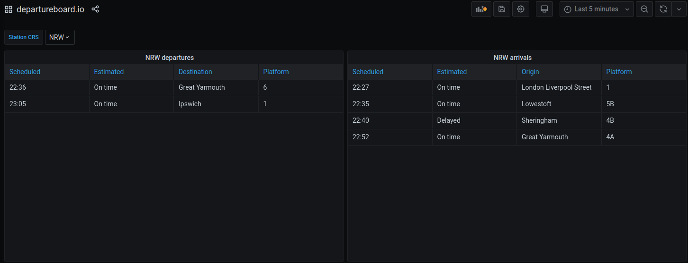

# grafana-datasource

A Grafana datasource plugin to visualize the easy to use departureboard.io JSON API for live information on train services across England, Scotland and Wales. Powered by National Rail Enquiries.

> Currently in alpha. The implementation and user facing query configuration is subject to change.
> Only developed and tested with Grafana 7.X.

## Features

- Query arrival and departure boards for a station by its CRS code.
  

## Development

Though it isn't necessary, development is made more convenient with [direnv](https://direnv.net/), [Lorri](https://github.com/target/lorri), and [Niv](https://github.com/nmattia/niv).

See the `buildInputs` variable in the `shell.nix` file for a list of tooling used in development.

### Testing

The build and test workflow uses [Mage](https://magefile.org/) which is a make/rake-like build tool using Go.

To start a Grafana container with the plugin installed:

```
$ mage start
```

To restart the grafana-server after changes to either the frontend source code (in `src/`) or backend source code (in `pkg/`):

```
$ mage restart
```

To stop the Grafana container:

```
$ mage stop
```

## To do

- Document datasource usage
- Support other endpoints
- Support more query parameters
- Support time ranges
- Understand Grafana SDK
- Provision dashboard JSON
- Publish datasource
